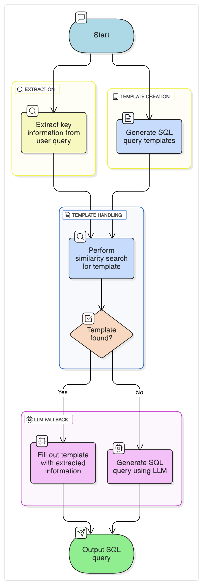

# RAG
## Text2SQL
### Method 1:
1. Directly provide database schema to LLM in prompt and then ask LLM to provide SQL query based on user query.

### Method 2:
1. Extract key information from user query first, ex: `date`, `model type`, etc.
2. Generate several SQL query templates manually.
3. Use similarity search to find correct template.
4. If a template is found, fill out the categories such as `date`, `model type`.
5. if not, create a SQL query by LLM.

  

